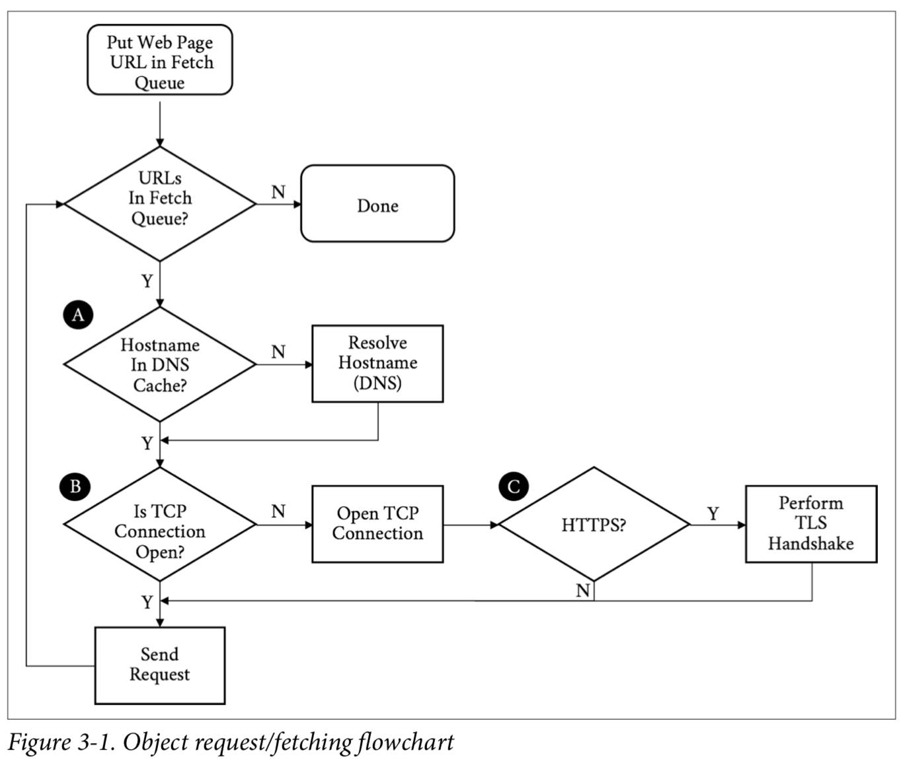
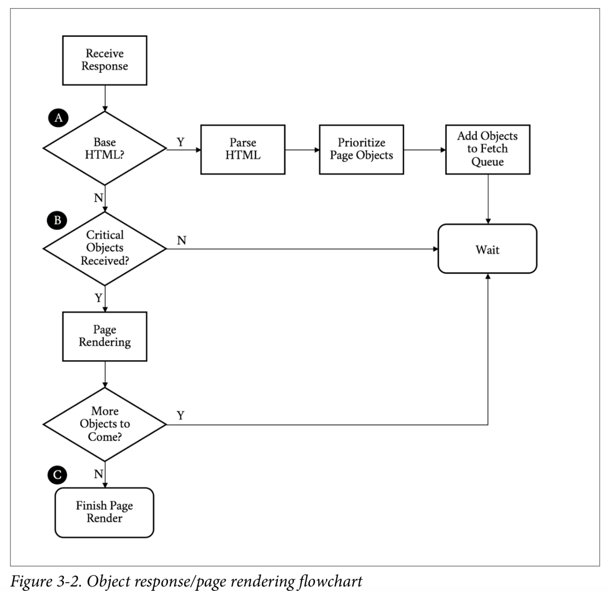
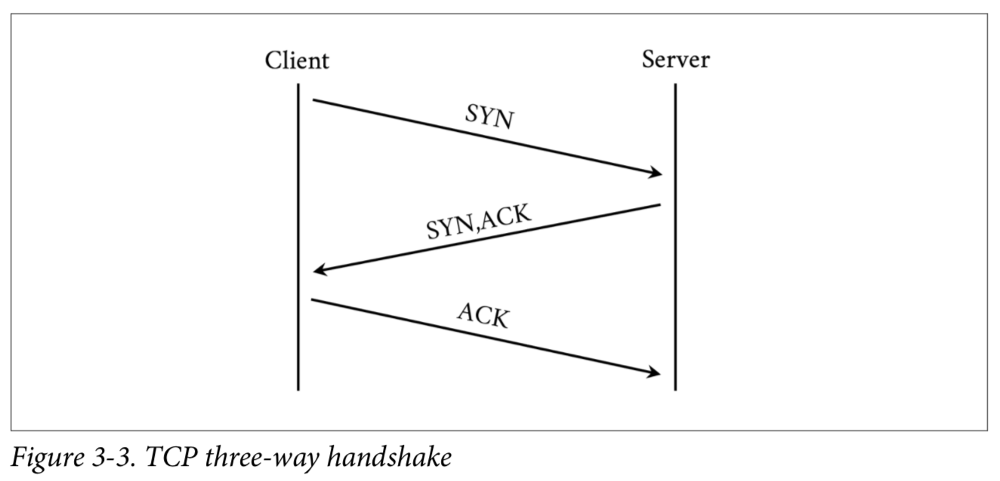

# HTTP 2

Http/2 aka h2 is a major revision of the HTTP network protocol used by the World Wide Web, meant to improve the perceived performance of loading web content.

* Since Http/1.1 aka h1 was approved in 1999, the web has changed significantly from mostly text-based webpages that weighed a few kilobytes and included less than 10 objects, to today’s media rich websites that weigh on average over 2 megabytes, and include an average of 140 objects.
* In 2009, Http/1.1 was well over a decade old, and arguably still the most popular application protocol on the internet. Not only was it used for browsing the web, it was the go-to protocol for a multitude of other things. Its ease of use, broader implementation, and widely shared understanding by developers and operation engineers gave it huge advantages, and made it hard to replace.

Evolution of HTTP
* In the 1930s Vannevar Bush, an electrical engineer from the United States then at MIT’s School of Engineering, had a concern with the volume of information people were producing relative to society’s ability to consume that information. In his essay published in the Atlantic Monthly in 1945 entitled, “As we may think”, he said: 
  * “Professionally our methods of transmitting and reviewing the results of research are generations old and by now are totally inadequate for their purpose. If the aggregate time spent in writing scholarly works and in reading them could be evaluated, the ratio between these amounts of time might well be startling.”
* He envisioned a system where our aggregate knowledge was stored on microfilm and could be “consulted with exceeding speed and flexibility.” He further stated that this information should have contextual associations with related topics, much in the way the human mind links data together. His memex system was never built, but the ideas influenced those that followed.
* The term Hypertext that we take for granted today was coined around 1963 and first publish in 1965 by Ted Nelson, a software designer and visionary. He proposed the concept of hypertext to mean:
  * ... a body of written or pictorial material interconnected in such a complex way that it could not conveniently be presented or represented on paper. It may contain summaries, or maps of its contents and their interrelations; it may contain annotations, additions and footnotes from scholars who have examined it.
* Nelson wanted to create a “docuverse” where information was interlinked and never deleted and easily available to all. He built on Bush’s ideas and in the 1970s created a prototype implementation of a hypertext system with his project Xanadu. It was unfortunately never completed, but provided the shoulders to stand on for those to come.
* HTTP enters the picture in 1989. While at CERN, Tim Berners-Lee proposed a new system for helping keep track of the information created by “the accelerators” (referring to the yet-to-be-built Large Hadron Collider) and experiments at the institution. He embraces two concepts from Nelson:
  * Hypertext or “Human readable information linked together in an unconstrained way” and
  * Hypermedia, a term to indicate that one is not bound to text
* In the proposal he discussed the creation of a server and browsers on many machines that could provide a “universal system”
* HTTP/0.9 and 1.0
* HTTP/0.9 was a wonderfully simple, if limited, protocol. It had a single method GET, there were no headers, and it was designed to only fetch HTML (just text).
* HTTP/1.0 (yr 1996) brought:
  * Headers
  * Response headers
  * Redirects
  * Errors
  * Conditional requests
  * Content encoding (compression)
  * More request methods
  * Flaws:
    * Inability to keep a connection open between requests
    * Lack of a mandatory Host header
    * Bare bones options for caching
* HTTP/1.1 brought:
  * Made Host header mandatory
    * Due to this it was now possible to perform virtual hosting, or serving multiple web properties on a single IP address. When the new connection directives are used, a web server is not required to close a connection after a response. This was a boon for performance and efficiency since the browser no longer needed to reestablish the TCP connection on every request.
  * An extension to cache ability headers
  * An OPTIONS method
  * The Upgrade header
  * Range requests
  * Compression with transfer-encoding
  * Pipelining
    * Pipelining is a feature that allows a client to send all of its requests at once. There were a couple of problems with pipelining that prevented its popularity. Servers still had to respond to the requests in order. This meant if one request takes a long time, this head of line blocking will get in the way of the other requests. Additionally, pipelining implementations in servers and proxies on the internet tended to range from nonexistent to broken.
* HTTP/2 expectations (fyi it is already out since 2015)
  * Substantially and measurably improve end-user perceived latency in most cases, over HTTP/1.1 using TCP
  * Address the “head of line blocking” problem in HTTP
  * Not require multiple connections to a server to enable parallelism, thus improving its use of TCP, especially regarding congestion control.
  * Retain the semantics of HTTP/1.1, leveraging existing documentation, including but not limited to HTTP methods, status codes, URIs, and header fields.

## Up and Running
There are two major steps to getting an h2 server up and running
  1. Get and install a web server that speaks h2
  2. Get and install a TLS certificate so the browser will speak h2 with the server

Get a certificate
* 3 methods to get a cert
  1. using online resources - creates self-signed certificate and is supposed to be used for testing purposes only
  2. creating a cert on your own - creates self-signed certificate. Is supposed to be used for testing purposes only
    * The `openssl` tool is fairly universal and easily obtainable. There are ports for almost every major platform.
    ```
    $ openssl genrsa -out privkey.pem 2048
    $ openssl req -new -x509 -sha256 -key privKey.pem -out cert.pem -days 365 -subj "/CN=fake.example.org"
    ```
    * with this you will have a new key called `privKey.pem` and a new cert called `cert.pem`
  3. obtaining a cert from a Certficate Authority (CA) - ex: Let's Encrypt
    * In order to obtain a certificate from Let's Encrypt, you will need to be able to validate your domain. This implies you have control of the domain and can
    prove it by modifying DNS or the web server. If you do not have a domain or do not want to be bothered, simply use the self-signed method shown previously.

## How and why we hack the web

### The Anatomy of a Web Page Request
* Before we dig in, it is important to have a baseline understanding of what we are trying to optimize; specifically, what goes on in the time between when users
click a link in a web browser and the page being displayed on their screen. When a browser requests a web page; it goes through a repetitive process to get all
of the information it needs to paint the page on the screen.
* It's easiest to think of this in two parts: *the object fetching logic*, and *the page parsing/rendering logic*.

* Walking through the flowchart, we:

  1. Put the URL to fetch in the queue
  2. Resolve the IP address of the hostname in the URL (A)
  3. Open a TCP connection to the host (B)
  4. If it is HTTPS request, initiate and finish a TLS handshake (C)
  5. Send the request for the base page url

* Continuing on with our walk through the flowchart, we:

  6. Receive the response
  7. If this is the base HTML, parse it and trigger prioritized fetches for the objects on the page (A)
  8. If the critical objects on a page have been received, start rendering (B)
  9. As additional objects are received, continue to parse and render until done (C)
* The preceding process needs to be repeated for every page click. It puts a strain on the network and device resources.
Working to optmize or eliminate any of these steps is core to the art of web performance testing.

### Critical performance
* With the previous diagrams we can call out the areas that matter for web performance and where our challenges may start.
Let's start with the network-level metrics that have an overall effect on the loading of a web page:
  * **Latency**
    * The latency is **how long it takes an IP packet to get from one point to another**. Related is the Round-Trip Time (RTT),
    which is twice the latency. Latency is a major bottleneck for performance, especially for protocols such as HTTP, which
    tend to make many round-trips to the server.
  * **Bandwidth**
    * **A connection between two points can only handle so much data at one time before it is saturated**. Depending on the
    amount of data on a web page and the capicity of the connection, bandwidth may be a bottleneck for performance.
  * **DNS Lookup**
    * **Before a client can fetch a web page, it needs to translate the hostname to an IP address using the Domain Name
    System (DNS), the internet's phone book**. This needs to happen for every unique hostname on the fetched HTML page
    as well, though luckily only once per hostname.
  * **Connection time**
    * Establishing a connection requires a back and forth (round-trip) between the client and the server called the
    "three-way handshake." This handshake time is generally related to the latency between the client and the server. The
    handshake involves sending a synchronize (SYN) packet from the client to the server, followed by an acknowledgement
    (ACK) of that SYN from the server, a SYN packet from the server to the client, and an ACK of that SYN from the client
    to the server.
  
  * **TLS negotiation time**
    * If the client is making an HTTPS connection, it needs to negotiate Transport Security Layer (TLS), the successor
    to Secure Socket Layer (SSL). This involves more round-trips on top of server and client processing time.
* At this point the client has yet to even send the request and has already spent a DNS round-trip plus a few more TCP and
TLS. Next we have metrics that are more dependent on the content or the performance of the server itself as opposed to the
network:
  * **Time to First Byte**
    * TTFB is the measure of time from when the client starts the navigation to a web page until the first byte of the base
    page response is received. It is a sum of many of the preceding metrics as well as any server processing time. For objects
    on a page, TTFB measures the time from when the browser sends the request to the time the first byte comes back.
  * **Content download time**
    * This is the Time to last byte (TTLB) for the requested object.
  * **Start Render Time**
    * How quickly is the client able to start putting something on the screen for the user? This is the measurement of how
    long the user spends looking at a blank page.
  * **Document Complete (aka Page Load Time)**
    * This is the time that the page is considered done by the client.
* When we look at web performance, especially if the goal is to create a new protocol that will make things faster, these
are the metrics that must be kept in mind. With those metrics in mind you can see the internet's trend toward more of
everything has led to performance bottlenecks. Here are some of the mores we need to keep in mind:
  * **More Bytes**
    * A truism is that every year, pages are larger, images are larger, and JS and CSS are larger. Larger means more bytes
    to download and longer page load times.
  * **More Objects**
    * Objects are not just larger, but there are many more of them. More objects can contribute to higher times overall as
    everything is fetched and processed.
  * **More complexity**
    * Pages and their dependent objects are getting increasingly complex as we add more and richer functionality. With
    complexity, the time to calculate and render pages, especially on weaker mobile devices with less processing power,
    goes up.
  * **More hostnames**
    * Pages are not fetched from individual hosts, and most pages have tens of referenced hosts. Each hostname means more
    DNS lookups, connection times, and TLS negotiations.
  * **More TCP sockets**
    * In an effort to address some of these mores, clients open multiple sockets per hostname. This increases the per-host
    connection negotiation overhead, adds load to the device, and potentially overloads network connections, causing effective
    bandwidth to drop due to retransmits and bufferbloat.

### The problems with HTTP/1.1
* **Head of line blocking**
  * A browser barely wants to get a single object from a particular host. More often, it wants to get many objects at the same time.
  HTTP/1 provides no mechanism to ask for those objects simultaneously. On a single connection it needs to send a request and then
  wait for a response before it can send another. h1 has a feature called pipelining that allows it to send a bunch of requests 
  at once, but it will still receive the responses one after another in the order they were sent. Additionally, pipelining is
  plagued by various issues around interop and deployment that make its use impractical.
  * If any problems occur with any of those requests or responses, everything else gets blocked behind the request /response.
  This is referred to as *head of line blocking*. It can grind the transmission and rendering of a web page to a halt. To combat
  this, today's browser will open up to 6 connections to a particular host and send a request down each connection. This
  achieves a type of parallelism, but each connection can still suffer from head of line blocking. In addition, it's not a
  good use of limited device resources.

* **Inefficient use of TCP**
  * TCP (Transmission Control Protocol) was designed to be conservative in its assumptions and fair to the different traffic
  uses on a network. Its congestion avoidance mechanisms are built to work on the poorest of networks and be relatively fair
  in the presence of competing demand. This is one of the reasons it has been as successful as it has--not necessarily because
  it is the fastest way to transmit data, but because it is one of the most reliable. Central to this is a concept called the
  *congestion window*. The congestion window is the number of TCP packets that the sender can transmit out before being
  acknowleged by the receiver. For example, if the congestion window was set to one, the sender would transmit one packet, and
  only when it gets the receiver's acknowlegement of that packet would it send another.
    * What is a Packet?
      * A packet, or more specifically an Internet Protocol (IP) packet, is a series of bytes (aka the payload) encapsulated in
      a structure (aka the frame) that defines how long the packet is, how it should be delivered (where it came from and where
      it is going), and other items needed to speak TCP. The most data we can effectively put in a packet's payload is 1460 bytes.
      Have an image that is conveniently 14,600 bytes in size? That will get split up into 10 packets.
  * Sending one packet at a time is not terribly efficient. TCP has a concept called *Slow Start* to determine what the correct
  congestion window should be for the current connection. The design goal for Slow Start is to allow a new connection to feel
  out the state of a network and avoid making an already congested network worse. It allows the sender to send an additional
  unacknowledged packet for every acknowledgement it receives. This means that on a new connection after the first aknowledgement,
  it could send two packets, and when those two are acknowledged, it could send 4, and so on. This geometric growth soon reaches
  an upper limit defined in the protocol, at which point the connection will enter what is called the *congestion avoidance phase*.

  * It takes a few round-trips to get to the optimal congestion window size. And those few round trips are precious time when it
  comes to addressing performance. Modern operating systems commonly use an initial congestion window size between 4 and 10 packets.
  When you consider a packet has a maximum size of around 1460 bytes on the lower end, only 5,840 bytes can be sent before the
  sender needs to wait for acknowledgements. Today's web pages are averaging around 2 MB of data, including the HTML and all
  dependent objects. On top of that, since browsers are commonly opening 6 connections to a particular host, they need to do
  this for each connection. This means this congestion window dance needs to occur 6 times in parallel. TCP will make certain
  that those connections play nicely together, but it does not guarantee that their performance will be optimal.

* **Fat message headers**
  * Though h1 provides a mechanism for the compression of the requested objects, there is no way to compress the message headers.
  Headers can really add up, and though on responses the ratio of header size to object size may be very small, the headers
  make up the majority (if not all) of the bytes on requests. With cookies, it is not uncommon for request headers to grow
  to a few kilobytes in size. 
  * The cost of the network latency begins to pile up quickly. Also, since the upload bandwidth is often constrained by the 
  network, especially in mobile cases, the windows might never get large enough to begin with, causing even more round-trips.
  * A lack of header compression can also cause clients to hit bandwidth limits. This is especially true on low-bandwidth or
  highly congested links. A classic example is the "Stadium Effect". When tens of thousands of people are in the same place
  at the same time, cellular bandwidth is quickly exhausted. Smaller requests with compressed headers would have an easier time
  in situations like that and put less overall load on the system.

* **Limited priorities**
  * When a browser opens up multiple sockets (each of which suffers from head of line blocking) to a host and starts  


