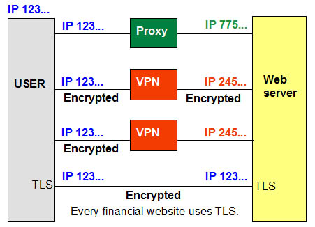
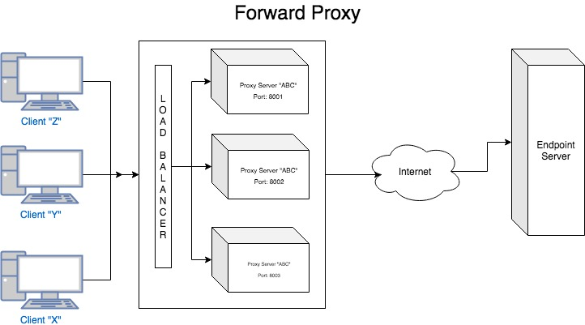

# Proxies

## Proxy Server

A proxy server is a computer system or router that functions as a relay between client and server. It helps prevent
an attacker from invading a private network and is one of the several tools used to build a firewall. The word proxy
means "to act on behalf of another", and a proxy server acts on behalf of the user. All requests to the Internet go
to the proxy server first, which evaluates the request and forwards it to the Internet. Likewise, responses come back
to the proxy server and then to the user.

Usually proxies are divided into 2 types: shared and dedicated proxies

### Shared Proxy
A shared proxy is a public proxy that can be easily accessed by anyone. As a rule, you can get shared proxies for
free, without any restrictions on the number of users they serve. Such servers often get overloaded by hundreds of
web users. This slows down the Internet connection and often results in huge lags and even crashes.

By using shared proxies, you will have to wait minutes for a web page to load, making it virtually impossible for
you to surf the web. Moreover, browsing the Internet via these open proxies is pretty much risky, since they can
be used by providers as a way to collect and steal your personal information.

There are also semi-dedicated proxies that have a limited number of users. They suit small groups of people, like
companies or schools, in order for them to create a shared network connection.

### Dedicated Proxy
A dedicated proxy allows you to use a proxy privately, which means you are the only person that uses it. This
empowers you to browse completely anonymously and securely with high page load speed.

### Proxy servers provide anonymity

Like a virtual private network (VPN), a proxy server hides the user's IP address when accessing the Internet.

### Address translation and caching

The proxy server is a dual-homed host with two network IP addresses. The address on the outbound side is the one
the Internet sees. Proxies are often used in conjunction with network address translation (NAT), which hides the
users' IP addresses on the internal network. Proxy servers may also cache Web pages so that the next request for that
page can be retrieved much faster.

### Other proxies

Anonymous proxy servers let users surf the Web and keep their IP address private. Although not specifically called
proxies, Internet email (SMTP) and the Usenet new system (NNTP) are somewhat similar because messages are relayed from
sender to recipient.

### Application level and circuit level

"Application level" proxies or "application-level gateways" are dedicated to specific content such as HTTP (Web) and
FTP (file transfer). In contrast, a "circuit-level" proxy supports every application.

### Forward and Reverse proxies

In this definition, the proxy servers are "forward proxies" that hide the details of the clients from the servers.
However, proxies can also reside at the website to hide details from the clients.

### A proxy server in a LAN

In this example, the proxy server functions as a firewall in the public side of a company network, which is called
the "demilitirized zone".

## 3 different types of proxy servers?

### Forward Proxy Server
Forward proxies are commonly used by internal networks. Once of the clients sends a request to get connected to
a particular website, it first has to pass through a Forward Proxy Server that decides whether or not the client
is allowed to approach this resource. If yes, the connection request goes to the external server that doesn't see
the client's IP address but sees only the connection request sent from the Forward Proxy Server.

A Forward Proxy Server provides full administrative control over the local network connections. It acts a shield
or firewall that lets the Administrators restrict access to unwanted web resources by the internal network clients.
You can see this kind of proxy servers in schools and universities.

### Reverse Proxy Server
Unlike a Forward Proxy Server, the Reverse Proxy Server works on the side of a website (or web service) hiding the
IP addresses within the internal network from the external users. The Reverse Proxy decides whether the web users
may see the content of a website or use a web service or not.

As far as the benefits are concerned, the Reverse Proxy Servers make it very hard for hackers to attack the
internal servers. Besides, it functions as a load balancer in order to disperse the data between the internal
servers that prevent overloading by tons of connection requests. Proxies of this type are used by web service
providers.

### Open Proxy Servers
Open Proxy Servers allow both forwarding the request by internet users and receiving responses from websites.
The key feature of this kind of proxy servers is hiding the user's original IP address from the web. Unlike
dedicated proxies, open proxy servers do not require authentication on the side of the user and are prone to
abuse and malware infections.

## Why should you use a Proxy Server?
1. More Privacy - proxies can encrypt your data, configuring your IP address so that you can hide your real
   location to "outplay" the network with no effort. This way, the server you are sending your request won't
   know your actual IP address and other personal information. It allows you to avoid risks like hacking attempts
   and identity thefts.

2. Access to any website - imagine you want to visit a website that restricts the contents to be viewed in
   your country. In this case, you can change your IP address. Due to this, you can gain access to virtually
   any website on the web that has this kind of limitation.

3. Higher security - since you can keep your data private, your internet connection becomes more secure. You
   can configure and modify your proxy in order for the web to see the only the info you allow it to get
   access to. Proxies also work as a web firewall that protects your device and filters the web resources
   that could probably contain malware.

4. Improved performance - proxy servers can also improve your browsing performance. For example, once you
   visit a website, it gets saved in a cache of your proxy server. It is especially beneficial when it comes
   to companies and organizations.

## Reverse Proxy: What, When, How

"Forward" and "Reverse" are seen in the context to the client (User-agent) accessing the resource. Resources could
be (not limited to):
* Services that are typically a website or an endpoint
* FTP servers

### Why?

Let's consider an example organization named QWERTY and that the infrastructure team has defined a policy like this:
1. Anyone who's accessing the internet will have to adhere to the policies defined in the organization..
2. Anyone who's accessing the service hosted in the infrastructure should not directly access the service endpoint.

### What?

As an employee, how will you access the resources?

For scenario 1, you will need to know:
* What are the policies or rules?
* Are you allowed to access the internet? (Allow also implies your designation (or) your IP address (or) any other
  filter criteria)

This would be difficult for an individual or a program to keep track of every resource on the internet that can be
accessed within an organization.

Instead, what if such things are defined in a server and you are allowed to remember only the server name and port
number. Forward proxy server does just that.

The proxy server acting on your behalf will forward your request to the intended endpoint/website. It also denies
serving the request if the resource does not meet the organization policy.

The configuration of forward proxies are inclined towards how the organization's infrastructure team decides on
the following parameters (not limited to):
1. What can be forwarded to the websites/endpoints?
2. What should be blocked to the user agents?
3. What is the bandwidth consumed when accessing the resources over the network?

For scenario 2

You would need to know what the proxy server is that will act on behalf of the website/endpoint that serves your
request. Partly this is sufficient to know. However, let's take an example:

You or your program wants to access an endpoint (Example: http://qwerty.com)

In this case, you know that the website has a domain name called qwerty.com and can be accessed via http protocol.
However, this is totally abstracted from the end user.

The configuration of reverse proxies are inclined towards the architectural decisions on the following parameters
(not limited to):
1. What happens to my service if it gets spammed with millions of requests?
2. What happens to my service if an attacker/hacker get access to the servers?
3. What happens to my service when an infrastructure update is required? This could be related to hardware or OS patches?
4. What happens to consumers of my service when I want to change my service name from http://qwerty.com to http://asdfgf.com?
5. What happens to my service when a dependent service is down?
6. What happens when my service endpoints have to be accessed via https but cannot pay for "N" number of ssl certificates?

Questions like the above will drive a person to choose reverse proxy.

