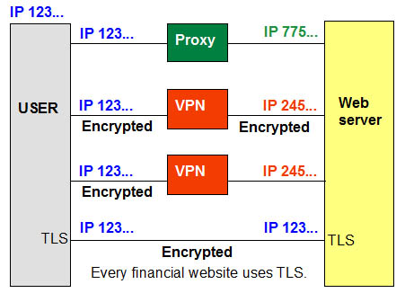
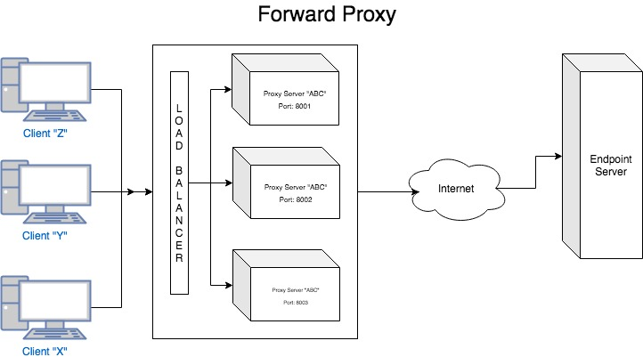
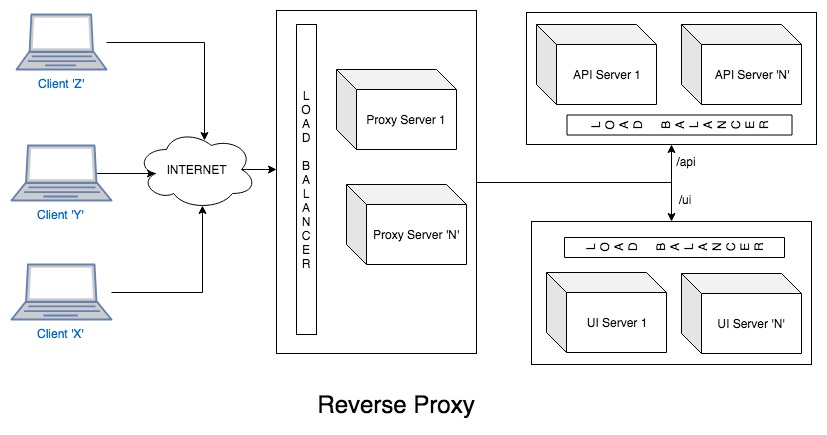

# Proxies

## Proxy Server

A proxy server is a computer system or router that functions as a relay between client and server. It helps prevent
an attacker from invading a private network and is one of the several tools used to build a firewall. The word proxy
means "to act on behalf of another", and a proxy server acts on behalf of the user. All requests to the Internet go
to the proxy server first, which evaluates the request and forwards it to the Internet. Likewise, responses come back
to the proxy server and then to the user.

### Proxy servers provide anonymity

Like a virtual private network (VPN), a proxy server hides the user's IP address when accessing the Internet.

### Address translation and caching

The proxy server is a dual-homed host with two network IP addresses. The address on the outbound side is the one
the Internet sees. Proxies are often used in conjunction with network address translation (NAT), which hides the
users' IP addresses on the internal network. Proxy servers may also cache Web pages so that the next request for that
page can be retrieved much faster.

### Other proxies

Anonymous proxy servers let users surf the Web and keep their IP address private. Although not specifically called
proxies, Internet email (SMTP) and the Usenet new system (NNTP) are somewhat similar because messages are relayed from
sender to recipient.

### Application level and circuit level

"Application level" proxies or "application-level gateways" are dedicated to specific content such as HTTP (Web) and
FTP (file transfer). In contrast, a "circuit-level" proxy supports every application.

### Forward and Reverse proxies

In this definition, the proxy servers are "forward proxies" that hide the details of the clients from the servers.
However, proxies can also reside at the website to hide details from the clients.

### A proxy server in a LAN

In this example, the proxy server functions as a firewall in the public side of a company network, which is called
the "demilitirized zone".

## Reverse Proxy: What, When, How

"Forward" and "Reverse" are seen in the context to the client (User-agent) accessing the resource. Resources could
be (not limited to):
* Services that are typically a website or an endpoint
* FTP servers

### Why?

Let's consider an example organization named QWERTY and that the infrastructure team has defined a policy like this:
1. Anyone who's accessing the internet will have to adhere to the policies defined in the organization..
2. Anyone who's accessing the service hosted in the infrastructure should not directly access the service endpoint.

### What?

As an employee, how will you access the resources?

For scenario 1, you will need to know:
* What are the policies or rules?
* Are you allowed to access the internet? (Allow also implies your designation (or) your IP address (or) any other
  filter criteria)

This would be difficult for an individual or a program to keep track of every resource on the internet that can be
accessed within an organization.

Instead, what if such things are defined in a server and you are allowed to remember only the server name and port
number. Forward proxy server does just that.

The proxy server acting on your behalf will forward your request to the intended endpoint/website. It also denies
serving the request if the resource does not meet the organization policy.

The configuration of forward proxies are inclined towards how the organization's infrastructure team decides on
the following parameters (not limited to):
1. What can be forwarded to the websites/endpoints?
2. What should be blocked to the user agents?
3. What is the bandwidth consumed when accessing the resources over the network?

For scenario 2

You would need to know what the proxy server is that will act on behalf of the website/endpoint that serves your
request. Partly this is sufficient to know. However, let's take an example:

You or your program wants to access an endpoint (Example: http://qwerty.com)

In this case, you know that the website has a domain name called qwerty.com and can be accessed via http protocol.
However, this is totally abstracted from the end user.

The configuration of reverse proxies are inclined towards the architectural decisions on the following parameters
(not limited to):
1. What happens to my service if it gets spammed with millions of requests?
2. What happens to my service if an attacker/hacker get access to the servers?
3. What happens to my service when an infrastructure update is required? This could be related to hardware or OS patches?
4. What happens to consumers of my service when I want to change my service name from http://qwerty.com to http://asdfgf.com?
5. What happens to my service when a dependent service is down?
6. What happens when my service endpoints have to be accessed via https but cannot pay for "N" number of ssl certificates?

Questions like the above will drive a person to choose reverse proxy.

